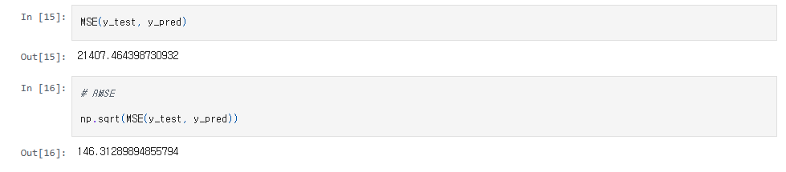
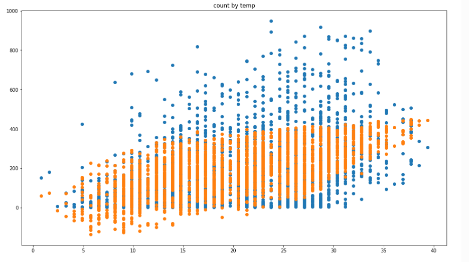
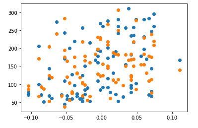
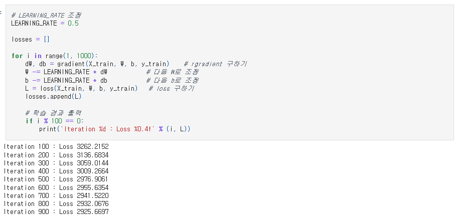
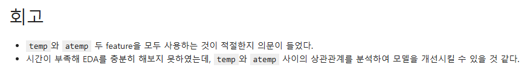

# AIFFEL Campus Online Code Peer Review Templete
- 코더 : 박수연
- 리뷰어 : 최현영


# PRT(Peer Review Template)
- [ ]  **1. 주어진 문제를 해결하는 완성된 코드가 제출되었나요?**
    - 문제에서 요구하는 최종 결과물이 첨부되었는지 확인
        - 네 그렇습니다.
        
        
        
    
- [ ]  **2. 전체 코드에서 가장 핵심적이거나 가장 복잡하고 이해하기 어려운 부분에 작성된 
주석 또는 doc string을 보고 해당 코드가 잘 이해되었나요?**
    - 해당 코드 블럭을 왜 핵심적이라고 생각하는지 확인
    - 해당 코드 블럭에 doc string/annotation이 달려 있는지 확인
    - 해당 코드의 기능, 존재 이유, 작동 원리 등을 기술했는지 확인
    - 주석을 보고 코드 이해가 잘 되었는지 확인
        - 중요! 잘 작성되었다고 생각되는 부분을 캡쳐해 근거로 첨부

    transpose가 일어나서 행렬곱이 수행되는 것이 의미상 중요한 부분이었는데 주석에 해당 코드의 작동 원리를 설명해주셔서 이해하기 좋았습니다.
    의미상 각 요소의 제곱을 행렬 연산에서 표현하려면 transpose가 필요합니다.
    
        
- [ ]  **3. 에러가 난 부분을 디버깅하여 문제를 해결한 기록을 남겼거나
새로운 시도 또는 추가 실험을 수행해봤나요?**
    - 문제 원인 및 해결 과정을 잘 기록하였는지 확인
    - 프로젝트 평가 기준에 더해 추가적으로 수행한 나만의 시도, 
    실험이 기록되어 있는지 확인
        - 중요! 잘 작성되었다고 생각되는 부분을 캡쳐해 근거로 첨부
    
    원하는 정도까지 학습을 진행시키기 위해서 다양한 learning rate 조건과 학습 iter 횟수를 조절하시면서 작성한 부분이 인상깊었습니다.
    
        
- [ ]  **4. 회고를 잘 작성했나요?**
    - 주어진 문제를 해결하는 완성된 코드 내지 프로젝트 결과물에 대해
    배운점과 아쉬운점, 느낀점 등이 기록되어 있는지 확인
    - 전체 코드 실행 플로우를 그래프로 그려서 이해를 돕고 있는지 확인
        - 중요! 잘 작성되었다고 생각되는 부분을 캡쳐해 근거로 첨부

    feature engineering에 대한 고민과 학습 효율에 대해서 고민하신 부분을 잘 작성해주셨습니다.
    특히 temp와 atemp에 대한 부분이 기억에 남습니다.
    

- [ ]  **5. 코드가 간결하고 효율적인가요?**
    - 파이썬 스타일 가이드 (PEP8) 를 준수하였는지 확인
    - 코드 중복을 최소화하고 범용적으로 사용할 수 있도록 함수화/모듈화했는지 확인
        - 중요! 잘 작성되었다고 생각되는 부분을 캡쳐해 근거로 첨부
        
    각 기능요소를 함수로 구성한 뒤 구현에 아무 문제가 없었습니다.


# 회고(참고 링크 및 코드 개선)
```
# 리뷰어의 회고를 작성합니다.
# 코드 리뷰 시 참고한 링크가 있다면 링크와 간략한 설명을 첨부합니다.
# 코드 리뷰를 통해 개선한 코드가 있다면 코드와 간략한 설명을 첨부합니다.

데이터 타입과 데이터 구성을 확인하시면서 진행한 기록이 보여서 인상깊었습니다.
주석이 상세히 달려있어서 노드를 진행하면서 배웠던 점들을 다시 확인해 볼 수 있었습니다.
```
