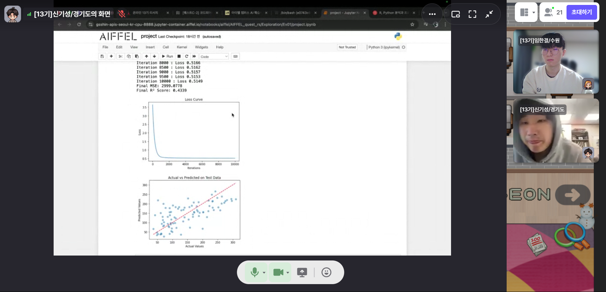
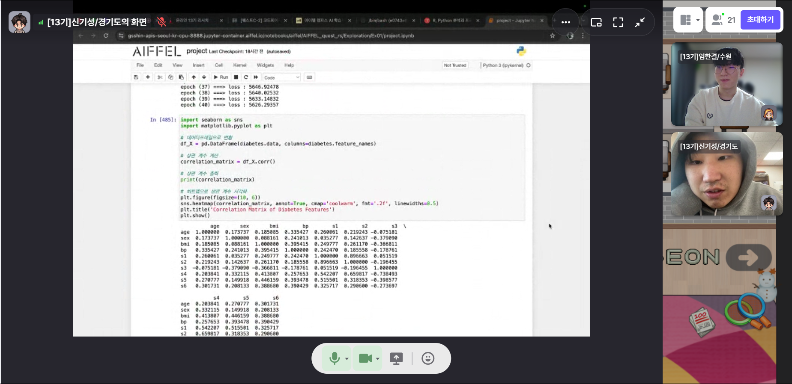
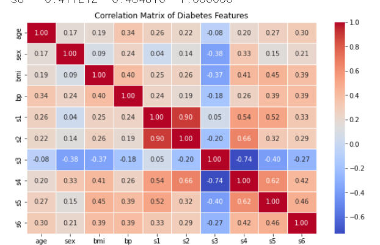
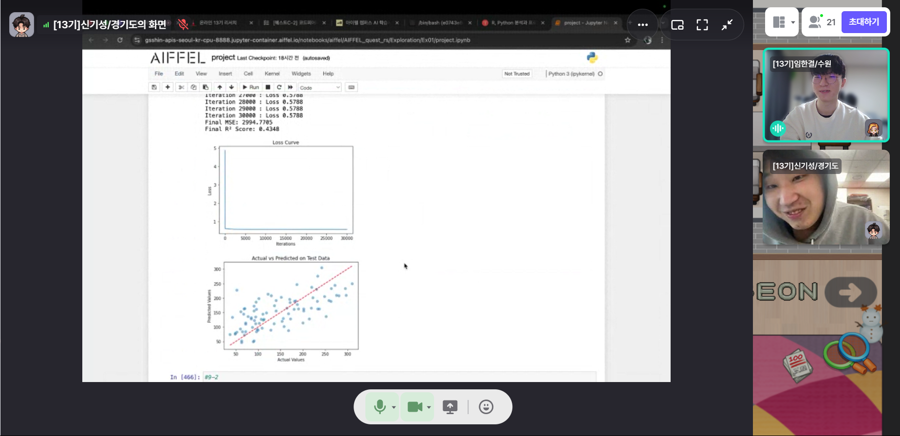
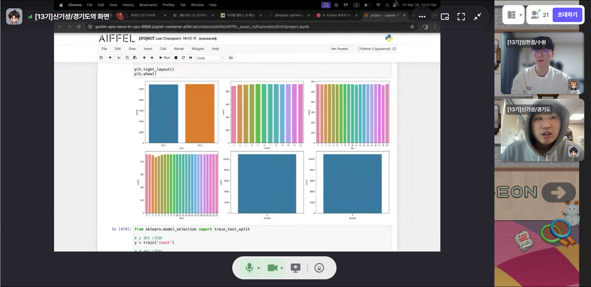
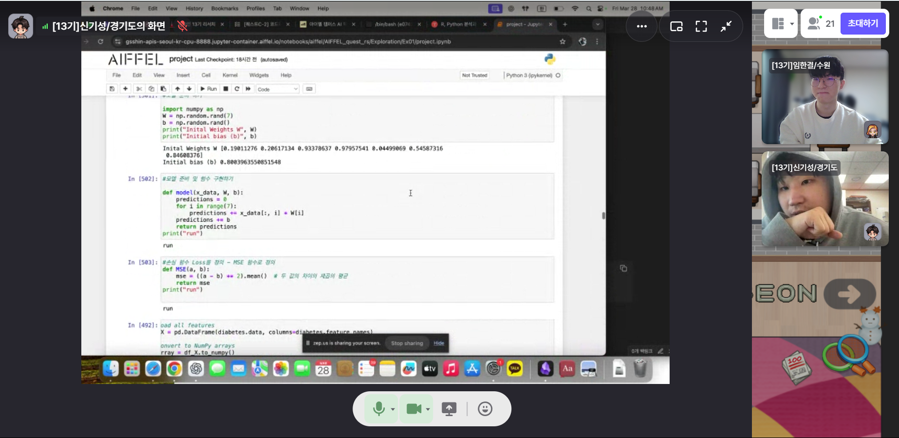

# AIFFEL Campus Online Code Peer Review Templete
- 코더 : 신기성
- 리뷰어 : 임한결


# PRT(Peer Review Template)
- [O]  **1. 주어진 문제를 해결하는 완성된 코드가 제출되었나요?**
    - 문제에서 요구하는 최종 결과물이 첨부되었는지 확인
        - 중요! 해당 조건을 만족하는 부분을 캡쳐해 근거로 첨부
    
    
    
    문제에서 요구하는 MSE, RMSE 값을 만족하는 결과물이 첨부되었습니다.

- [O]  **2. 전체 코드에서 가장 핵심적이거나 가장 복잡하고 이해하기 어려운 부분에 작성된 
주석 또는 doc string을 보고 해당 코드가 잘 이해되었나요?**
    - 해당 코드 블럭을 왜 핵심적이라고 생각하는지 확인
    - 해당 코드 블럭에 doc string/annotation이 달려 있는지 확인
    - 해당 코드의 기능, 존재 이유, 작동 원리 등을 기술했는지 확인
    - 주석을 보고 코드 이해가 잘 되었는지 확인
        - 중요! 잘 작성되었다고 생각되는 부분을 캡쳐해 근거로 첨부
    
    
    상관계수행렬을 작성하여, 상관계수가 작은 feature들을 학습에서 제외시키는 부분이 첨부되었습니다.

- [O]  **3. 에러가 난 부분을 디버깅하여 문제를 해결한 기록을 남겼거나
새로운 시도 또는 추가 실험을 수행해봤나요?**
    - 문제 원인 및 해결 과정을 잘 기록하였는지 확인
    - 프로젝트 평가 기준에 더해 추가적으로 수행한 나만의 시도, 
    실험이 기록되어 있는지 확인
        - 중요! 잘 작성되었다고 생각되는 부분을 캡쳐해 근거로 첨부
    
    
    loss가 부족한 부분을 해결하기 위해 피처 엔저니어링을 시도한 흔적이 기록되어 있었습니다.
    
- [O]  **4. 회고를 잘 작성했나요?**
    - 주어진 문제를 해결하는 완성된 코드 내지 프로젝트 결과물에 대해
    배운점과 아쉬운점, 느낀점 등이 기록되어 있는지 확인
    - 전체 코드 실행 플로우를 그래프로 그려서 이해를 돕고 있는지 확인
        - 중요! 잘 작성되었다고 생각되는 부분을 캡쳐해 근거로 첨부
    
    데이터 시각화등을 통해서 데이터를 잘 이해하려고 노력한 부분을 찾아 볼 수 있었고, 앞서 첨부되었던 상관계수 행렬이나 결과값 시각화를 통해 프로젝트의 진행 상태를 이해하고 있었음을 확인할 수 있었습니다.
        
- [O]  **5. 코드가 간결하고 효율적인가요?**
    - 파이썬 스타일 가이드 (PEP8) 를 준수하였는지 확인
    - 코드 중복을 최소화하고 범용적으로 사용할 수 있도록 함수화/모듈화했는지 확인
        - 중요! 잘 작성되었다고 생각되는 부분을 캡쳐해 근거로 첨부
    
    
    코드에서 여러 함수들을 모듈화하여 중복을 최소화하려고 노력한 부분을 첨부했습니다.


# 회고(참고 링크 및 코드 개선)
```
여럿 시도를 통해 코드 개선이 이루어진 것을 확인할 수 있었습니다.
특히, 1번 프로젝트에서 loss를 줄이기 위해서 correlation maxtrix를 직접 보고 가장 관계가 없다고 판단되는 festure들을 제거해보고, 또 그 결과 실제로 줄어든 loss를 확인해보는 과정이 인상깊었습니다. 

또한, 학습의 전반적인 내용을 잘 이해하고 새로운 방식을 찾아 코드에 적용할 수 있으며, 무엇보다도 학습에 대한 열정이 뛰어나시기 때문에, 앞으로 더 창의적이고 멋진 코드를 작성할 수 있을 것이라고 생각이 듭니다.
```