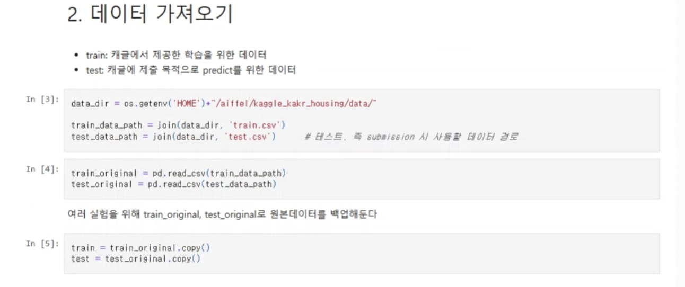
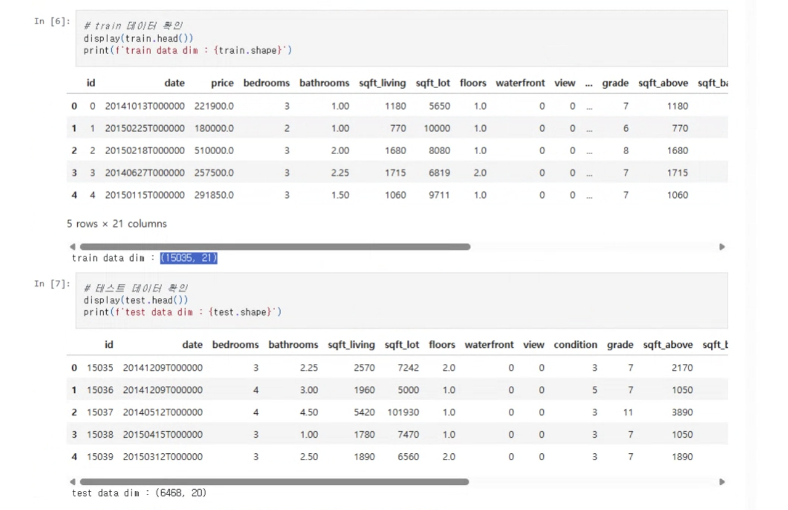
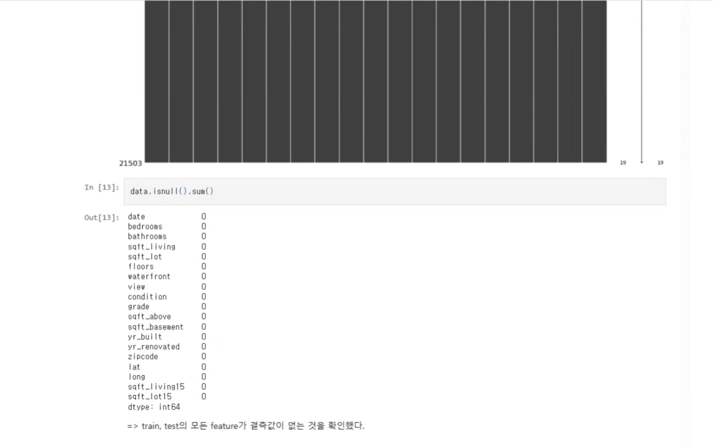
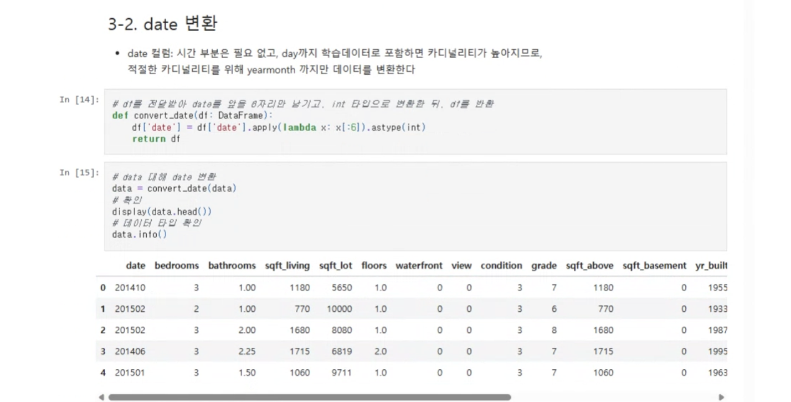

# AIFFEL Campus Online Code Peer Review Templete
- 코더 :박수연.
- 리뷰어 : 신기성.


# PRT(Peer Review Template)
- [ ]  **1. 주어진 문제를 해결하는 완성된 코드가 제출되었나요?**
    - 문제에서 요구하는 최종 결과물이 첨부되었는지 확인
 	문제에서 요구하는 최종 결과물이 첨부 되었습니다.
    
    
- [ ]  **2. 전체 코드에서 가장 핵심적이거나 가장 복잡하고 이해하기 어려운 부분에 작성된 
주석 또는 doc string을 보고 해당 코드가 잘 이해되었나요?**
    - 네 젠체 코드에서 이해가 잘 되었습니다.
    - 네 정말 코드가 잘 정리  되어 있었습니다.
    - 네 해당 코드의 기능 성능등을 잘 설명했다.
    - 네 정말 알기 쉽게 되어 있었습니다.
        - 중요! 잘 작성되었다고 생각되는 부분을 캡쳐해 근거로 첨부
   

- [ ]  **3. 에러가 난 부분을 디버깅하여 문제를 해결한 기록을 남겼거나
새로운 시도 또는 추가 실험을 수행해봤나요?**
    - 문제 원인 및 해결 과정을 잘 기록하였는지 확인
    - 네 그것 또한 되어 있었습니다. 
        - 중요! 잘 작성되었다고 생각되는 부분을 캡쳐해 근거로 첨부
         

- [ ]  **4. 회고를 잘 작성했나요?**
    - 네 확실히 주어졌습니다.
    - 네 코드 실행 플로우 또한 완벽히 작성되어 있었습니다.
        - 중요! 잘 작성되었다고 생각되는 부분을 캡쳐해 근거로 첨부
        
- [ ]  **5. 코드가 간결하고 효율적인가요?**
    - 코드 스타일 또한 확인하였습니다.
    - 네 코드 중복을 확인 하고 진행 하였습니다.
        - 중요! 잘 작성되었다고 생각되는 부분을 캡쳐해 근거로 첨부

  

# 회고(참고 링크 및 코드 개선)
```
# 정말 많은 부분을 코딩에서 배울 수 있는것 같습니다.
```
